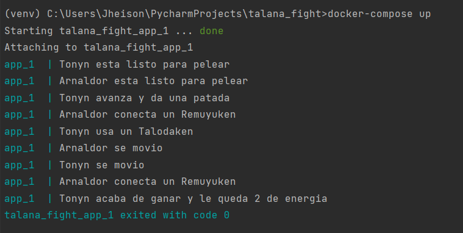

# Talana Fight

This project narrates a fight and gives the final result.


## Running main.py

This project use docker and docker-compose. To run the file main.py, run the following command

```bash
docker-compose up
```


## Screenshots



